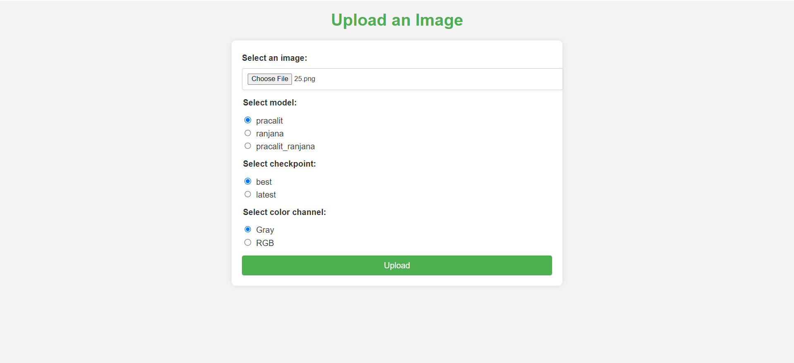

# Newa-OCR

Newa-OCR is a Python application designed for Optical Character Recognition (OCR) of Newari Lipi scripts, including Pracalit and Ranjana Lipi. This project leverages advanced OCR techniques to accurately read and process text in these traditional Newari scripts.

## Features

- **OCR Support**: Recognizes text in Newari Lipi scripts (Pracalit and Ranjana).
- **Web Interface**: Simple and intuitive interface for uploading images and viewing OCR results.
- **Translations**: Provides translations of OCR results into Nepali and English.

## Prerequisites

- **Python**: Version 3.10
- **Dependencies**: Required libraries are listed in `requirements.txt`

## Installation

1. **Clone the Repository**

   ```bash
   git clone https://github.com/yourusername/newa-ocr.git
   cd newa-ocr
   ```

2. **Create a Virtual Environment**

   ```bash
   python -m venv venv
   source venv/bin/activate  # On Windows use `venv\Scripts\activate`
   ```

3. **Install Dependencies**

   ```bash
   pip install -r requirements.txt
   ```

## Usage

1. **Run the Application**

   ```bash
   python app.py
   ```

2. **Access the Web Interface**

   Open your web browser and navigate to [http://127.0.0.1:5000/](http://127.0.0.1:5000/) to access the application.

3. **Upload an Image**

   - Select an image containing Newari Lipi text (either Pracalit or Ranjana).
   - Choose the OCR model and checkpoint from the available options.
   - Submit the form to process the image and receive the OCR results.

4. **View Results**

   The results, including translations into Nepali and English (if applicable), will be displayed on the results page.

## Inference Results:

Inferencing the applicaation.

### Homepage



### Pracalit Inference


### Ranjana Inference


## Contributing

Contributions are welcome! Please fork the repository and submit a pull request with your changes. Ensure that your code follows the existing coding standards and includes appropriate tests.

## License

This project is licensed under the MIT License. See the [LICENSE](LICENSE) file for details.

## Contact

For any questions or issues, please contact:

- **Email**: [bibekthapa.works@gmail.com](mailto:bibekthapa.works@gmail.com)
- **LinkedIn**: [Bibek Thapa](https://www.linkedin.com/in/bibek-thapa-sb1129/)